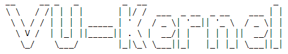
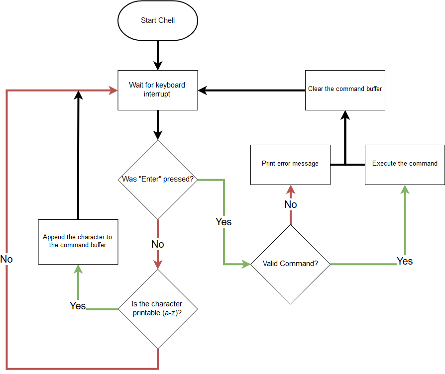

# VU-Kernel


## About

`VU-Kernel` is a small kernel written in C.

The current target architecture is `i386`(32 bit version of the x86 ISA).

Currently implemented features:

* Printing to the screen
* Getting keyboard input
* [GDT](https://en.wikipedia.org/wiki/Global_Descriptor_Table) and [IDT](https://en.wikipedia.org/wiki/Interrupt_descriptor_table) are set up
* [Paging](https://en.wikipedia.org/wiki/Paging)
* Memory Management (allocation/deallocation)
* [ATA Driver](https://wiki.osdev.org/ATA_PIO_Mode)
* Start of a VFS, with support for [FAT12](https://en.wikipedia.org/wiki/File_Allocation_Table#FAT12)
* Shell-like REPL called `Chell`

## Prerequisites

A number of programs must be installed before `VU-Kernel` can be run:

- [make](https://www.gnu.org/software/make/)
    - Version 4.1
    - Used to easily compile and run the kernel
- [gcc](https://gcc.gnu.org/)
    - Version 7.3.0
    - Used to compile the `.c` files
- [nasm](https://nasm.us/)
    - Version 2.13.02
    - Use to compile `.nasm` files
- [binutils](https://www.gnu.org/software/binutils/)
    - Includes `ld` which links `.o` files
- [qemu](https://www.qemu.org/)
    - Version 2.11.1
    - System Emulation, that runs the `VU-Kernel` image

## Running `VU-Kernel`

Running `VU-Kernel` is as simple as typing:

```
make qemu
```

This will create a bootable `.iso` file, used by `qemu`.

## `Make` targets

- kernel
    - Builds the `VU-Kernel` binary, located at `vu-kernel/kernel`
- qemu
    - Builds the `VU-Kernel` binary and runs it in qemu
- iso
    - Builds a bootable iso image, with `VU-kernel` as the boot image

## Chell


`Chell` is a shell-like [REPL](https://en.wikipedia.org/wiki/Read%E2%80%93eval%E2%80%93print_loop).

The loop of `Chell` is shown below:



Some commands include:

* ls - list the files located on the atteched ATA drive
* pci - print information about any connected PCI devices
* logo - print the `Chell` logo

## TODO

- [x] [Bootstrapping](https://jakubclark.github.io/jekyll/update/2019/04/18/bootstrapping.html)
- [x] [Printing to the screen](https://jakubclark.github.io/jekyll/update/2019/04/18/printing-to-the-screen.html)
- [x] Reading from the keyboard
- [x] Setting up the Global Descriptor Table
- [x] Print Multiboot Information on startup
- [x] Interrupt Handling
- [x] Physical Memory
- [x] Virtual Memory
- [x] ATA Driver
- [ ] FAT12
- [ ] VFS
